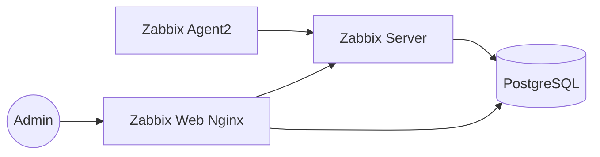

# Zabbix Monitoring Demo


## Architecture



```text
Admin → Web UI :8082 → Zabbix Server → PostgreSQL
                Agent → Server :10051
```

**Stack skill:** `Zabbix` · `Linux` · `Docker` · `Nginx` (optional proxy)

Portfolio lab for Zabbix 7 server + web + PostgreSQL + agent.

## Quick start
```bash
docker compose up -d
# Web UI: http://localhost:8082
# Login: Admin / zabbix
```

## What this shows
- Zabbix server + web UI deployment
- PostgreSQL backend for metrics history
- Zabbix agent for host metrics
- Example host/template notes for Linux monitoring
- Alerting idea: trigger when agent unreachable / high CPU

## Useful after start
1. Open UI → Configuration → Hosts
2. Ensure `Zabbix server` host is **Enabled** and has agent interface
3. Check Latest data for CPU / memory / filesystem

> Demo passwords are intentionally simple — change for real environments.

## Screenshots / how it looks

> Diagrams above show architecture. Run the stack locally and attach UI screenshots here if needed:
> - `docs/screenshots/` folder (optional)
> - keep secrets out of screenshots
